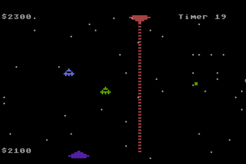

# 10line-2016-Traffic
Traffic game in Turbo BASIC XL for Atari 8-bit. Entry for 2016 10-line BASIC contest

Vehicle traffic on the intergalactic superhighway is at an all time high. Spaceships and satellites zoom through the skies at a breakneck pace. The Intergalactic Chairperson for Traffic and Commerce is taking action to reduce the scourge of space traffic: randomly blowing up as many commuters as possible. Your job as an intergalactic traffic enforcement officer is to destroy as many vehicles as possible.

Your earnings depend on how many vehicles you destroy during your shift. The faster a vehicle is traveling, the more you’ll earn. And those little personal satellites are so small and fast and annoying, the Intergalactic Chairperson pays a big bonus for destroying those. She also keeps close track of your accuracy. Space laser beams aren’t cheap, you know.

Your job requires one standard issue joystick controller. If you choose to team up with a partner during your duty shift, he or she will also need a joystick controller.

This is my fourth entry for the 2016 BASIC tenliners contest, another 256-character EXTREM-256 entry.

Full code description is at https://atariaction.tumblr.com/post/138952621597/traffic
